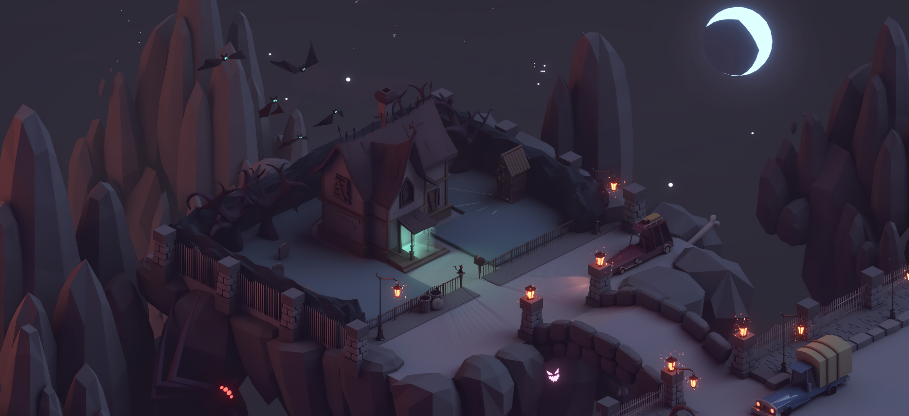

<!-- ----------- HEAD SECTION ------------ -->

<!-- 

 -->

  

 

<!-- ----------- HEAD SECTION END ------------ -->

<!-- ----------- TECH STACK SECTION ------------ -->

                    

<!-- ----------- TECH STACK SECTION END------------ -->

<!-- ----------- GITHUB STATS SECTION ------------ -->

&nbsp;

<!-- ----------- GITHUB STATS SECTION END ------------ -->

<!-- ----------- CONNECT WITH ME SECTION ------------ -->

  
 
 

<!-- ----------- CONNECT WITH ME SECTION END ------------ -->

[twitter]: https://twitter.com/AryamanZ29
[instagram]: https://www.instagram.com/aryaman_z29/
[linkedin]: https://www.linkedin.com/in/aryamanz29
[github]:https://github.com/Aryamanz29
[gmail]:mailto:aryamanz29@gmail.com
